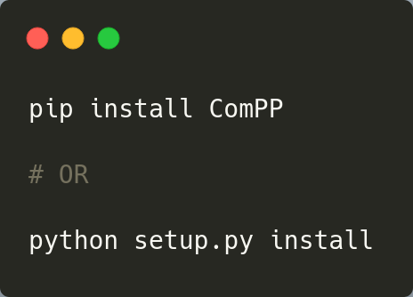
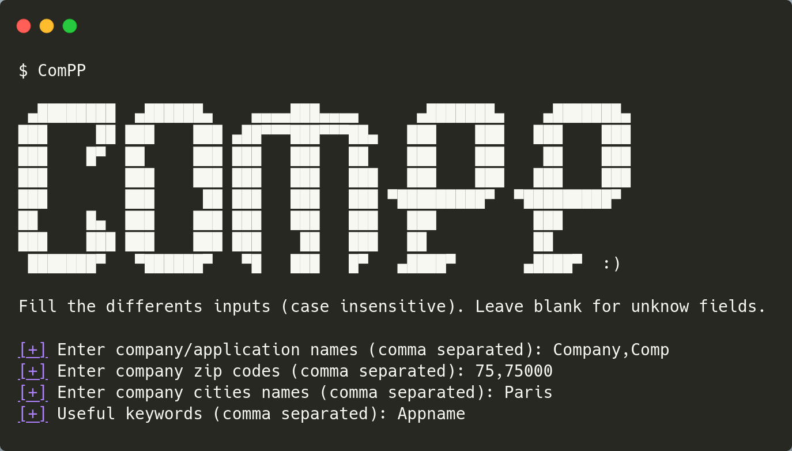

# ComPP - Company Passwords Profiler


[](https://github.com/sec-it/ComPP/network)
[](https://github.com/sec-it/ComPP/stargazers)
[](https://github.com/sec-it/ComPP/blob/master/LICENSE.txt)

Company Passwords Profiler (aka ComPP) helps making a bruteforce wordlist for a targeted company.

## What ❓

The tool responds to a need to generate wordlists **quickly** with **few inputs**. The generated passwords will contain generic company informations with transformation such as `APPNAME2019!` or `Company75000$`.

The main use of the generated wordlist is with **remote bruteforce and password spraying attack** such as a ssh service or a WordPress website.

This tool aims to replace [CeWL](https://github.com/digininja/CeWL) because web scrapping is not be the most efficient way to generate a wordlist.

Note: If you have time to perform OSINT research against the targeted users, you may use tools such as [CUPP](https://github.com/Mebus/cupp) or [BEWGor](https://github.com/berzerk0/BEWGor) to **complete** your wordlist.

## Install ⚙️



## Inputs 🔡

User inputs can either be filled in the interactive prompt or through a json file. If an input is unknown to the user, it suffices to leave the field empty in order to go to the next field. Here is the full program prompt:

```text
$ ComPP
```



or

```text
$ ComPP example.json
```

## Outputs

Output size may vary with the provided options. Here is a preview of what you can expect with the default options:

```text
appname$
CompParis2000
Company75000!
COMPANYAPPNAME2019#
```

## What are the proposed transformations ?

1. First, the tool compute case transformation for each fields (lowercase, UPPERCASE and Capitalize). The originals set of fields and the 3 generated sets are added to the wordlist.
2. Then, the tool apply [itertools.combination()](https://docs.python.org/3/library/itertools.html#itertools.permutations) on each set with a default size up to 2. The use of such combination avoid having the same word twice in the same password. The generated combinations are added to the wordlist
3. The tool add a range of years to the previously generated wordlist. The original wordlist is also kept.
4. The tool add a range of special chars to the previously generated wordlist. The original wordlist is also kept.
5. (Optional) The tool add a range of numbers to the previously generated wordlist. The original wordlist is also kept.
6. (Optional) The tool add a l33t transformation to the previously generated wordlist. The original wordlist is also kept.

## Author

Made by Alex G. (@zeecka_), pentester at SEC-IT.